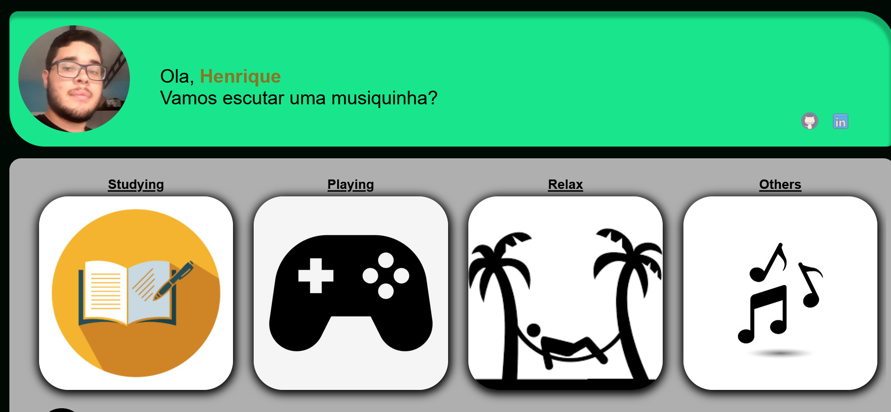

# Playlist Musical V 1.0



> Esse site possui minhas musicas favoritas separado em playlist musicais

---

### Tabela de conteudos
Atalho rápido

- [Descrição](#Descrição)
- [Aprendizados](#Aprendizados)
- [Roadmap](#roadmap)
- [License](#license)
- [Informações](#Informaçao-do-autor)

---

## Descrição

Esse projeto foi passado pelo Professor Gabriel no curso do Instituto Proa. Onde o objetivo era produzir um site playlist onde possui minhas musicas favoritas, foi uma experiencia incrivel. O aprendizado foi muito importante e desafiador. (Não está responsivo)

#### Tecnologias

- HTML
- CSS
- JS

[Voltar para o topo](#Tabela-de-conteudos)

---

## Aprendizados

#### Caso queira testar. Baixe os arquivos no seu computador e abra o index.html


#### Codigos aprendidos

```javascript
    element.classList.toggle(element);
```
[Voltar para o topo](#Playlist-Musical-V-1.0)

---

## Roadmap

- [x] Add Readme
- [ ] Responsividade
- [ ] Funcionamento do botão criar playlist

[Voltar para o topo](#Playlist-Musical-V-1.0)

---

## License

MIT License

Copyright (c) [2017] [James Q Quick]

Permission is hereby granted, free of charge, to any person obtaining a copy
of this software and associated documentation files (the "Software"), to deal
in the Software without restriction, including without limitation the rights
to use, copy, modify, merge, publish, distribute, sublicense, and/or sell
copies of the Software, and to permit persons to whom the Software is
furnished to do so, subject to the following conditions:

The above copyright notice and this permission notice shall be included in all
copies or substantial portions of the Software.

THE SOFTWARE IS PROVIDED "AS IS", WITHOUT WARRANTY OF ANY KIND, EXPRESS OR
IMPLIED, INCLUDING BUT NOT LIMITED TO THE WARRANTIES OF MERCHANTABILITY,
FITNESS FOR A PARTICULAR PURPOSE AND NONINFRINGEMENT. IN NO EVENT SHALL THE
AUTHORS OR COPYRIGHT HOLDERS BE LIABLE FOR ANY CLAIM, DAMAGES OR OTHER
LIABILITY, WHETHER IN AN ACTION OF CONTRACT, TORT OR OTHERWISE, ARISING FROM,
OUT OF OR IN CONNECTION WITH THE SOFTWARE OR THE USE OR OTHER DEALINGS IN THE
SOFTWARE.

[Voltar para o topo](#Playlist-Musical-V-1.0)

---

## Informaçao do autor

- Linkedin - [@henriquegcosta](https://www.linkedin.com/in/henriquegcosta/)
- Github - [Henriquegcosta](https://github.com/Henriquegcosta)

[Voltar para o topo](#Playlist-Musical-V-1.0)
